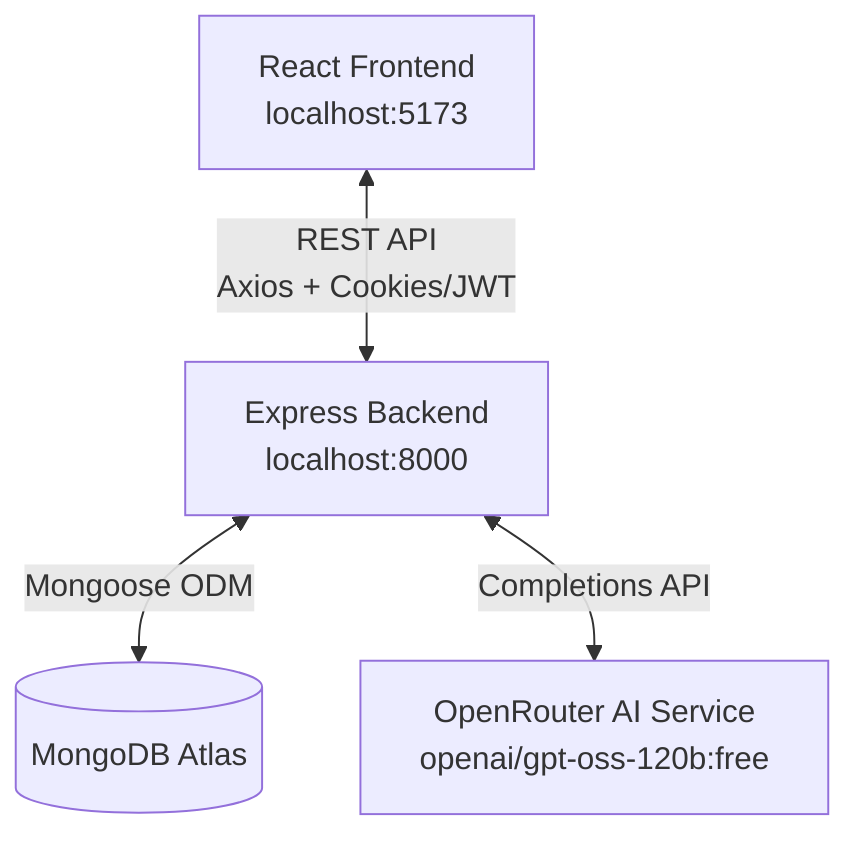
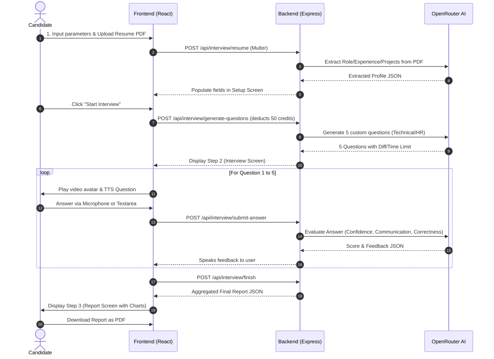

# AI Mock Interview — Full-Stack AI-Powered Interview Prep Platform

An advanced, full-stack AI-powered mock interview platform designed to help users prepare for technical and HR interviews. The platform provides an interactive experience where an AI interviewer speaks questions, listens to voice answers, evaluates responses across multiple dimensions, and generates detailed, downloadable performance reports.

---

## 🚀 Key Features

- 🎙️ **Interactive AI Interviewer**: Live voice interaction powered by Web Speech API (TTS) and Webkit Speech Recognition (STT).
- 📄 **Resume Analyzer & Parser**: Upload PDF resumes to automatically extract candidate role, experience level, key projects, and skills.
- ⚙️ **Custom Interview Setup**: Choose between **Technical** and **HR** modes with a structured difficulty progression (Easy → Medium → Hard).
- 🤖 **Context-Aware Questioning**: AI dynamically tailors questions based on the candidate's resume, specific projects, and selected focus area.
- 📊 **Detailed Evaluation & Scoring**: Each answer is evaluated by a 120-billion parameter LLM across three core pillars:
  - *Confidence & Clarity*
  - *Communication*
  - *Correctness & Completeness*
- 📈 **Performance Analytics**: Visualized performance graphs (scores per question, skill breakdown charts) and persistent, shareable report links.
- 💳 **Credit-Based System**: Integrated credit validation (e.g., 50 credits per interview session) to manage API resources.
- 🖨️ **PDF Report Export**: Professional PDF report generation using `jsPDF` for offline viewing.

---

## 🛠️ Tech Stack

### Frontend (`client/`)
* **Framework**: React 19, Vite 8, React Router DOM v7
* **State Management**: Redux Toolkit, React Redux
* **Styling & Animation**: Tailwind CSS v4, Motion (Framer Motion)
* **Authentication**: Firebase (Google OAuth)
* **HTTP Client**: Axios (with cookies/credentials)
* **Visualization**: Recharts, react-circular-progressbar
* **PDF Export**: jsPDF + jspdf-autotable
* **Icons**: React Icons

### Backend (`server/`)
* **Runtime**: Node.js (ESM modules)
* **Framework**: Express 5
* **Database**: MongoDB (via Mongoose 9)
* **Authentication**: JSON Web Token (JWT) with HTTP-only cookies
* **AI Service**: OpenRouter API (`openai/gpt-oss-120b:free` model)
* **PDF Parser**: `pdfjs-dist` (legacy build for extracting text from resume uploads)
* **File Upload**: Multer

---

## 🏗️ Architecture



### Monorepo Structure
```
ai_mock_interview/
├── client/                 # React frontend application
│   ├── src/
│   │   ├── assets/         # Audio, video, and image assets
│   │   ├── components/     # UI Components (Step1SetUp, Step2Interview, Step3Report, etc.)
│   │   ├── pages/          # Page views (Home, Auth, History, Pricing, Report)
│   │   ├── redux/          # Redux Toolkit store and user slice
│   │   └── utils/          # Helper utilities (Firebase configuration, etc.)
│   └── package.json
└── server/                 # Express backend application
    ├── config/             # DB connection, configuration helpers
    ├── controllers/        # Route controllers (auth, user, interview)
    ├── middlewares/        # Express middlewares (auth, multer upload)
    ├── models/             # Mongoose schemas (User, Interview)
    ├── services/           # AI wrapper service (OpenRouter API client)
    ├── index.js            # App entry point
    └── package.json
```

---

## ⚙️ Environment Setup

### 1. Clone & Set Up the Backend
Navigate to the `server/` directory and create a `.env` file:
```bash
cd server
```

Create a `.env` file with the following variables:
```env
PORT=8000
MONGODB_URL=your_mongodb_connection_string
JWT_SECRET=your_jwt_secret_key
OPENROUTER_API_KEY=your_openrouter_api_key
```

### 2. Set Up the Frontend
Navigate to the `client/` directory and create a `.env` file:
```bash
cd ../client
```

Create a `.env` file with the following variable:
```env
VITE_FIREBASE_API_KEY=your_firebase_api_key
```

> **Note**: Configure your Firebase project (e.g., `interview-agent-6b9cc`) to support Google Authentication.

---

## 🚀 Running the Application

### Start Backend Server
```bash
cd server
npm install
npm run dev
```
Runs the Express server on [http://localhost:8000](http://localhost:8000).

### Start Frontend Client
```bash
cd client
npm install
npm run dev
```
Runs the Vite development server on [http://localhost:5173](http://localhost:5173).

---

## 📋 Interview Flow



### Credit System Logic
- Each new user starts with **100 credits**.
- Launching an interview costs **50 credits** (deducted at the question generation phase).
- Minimum **50 credits** is required to begin.

---

## 🛠️ API Documentation

### Authentication (`/api/auth`)
* `POST /api/auth/google` - Verifies Google Sign-in payload, finds/creates a user, and issues an HTTP-only JWT token.
* `GET /api/auth/logOut` - Clears the authentication token cookie.

### User Configuration (`/api/user`)
* `GET /api/user/current-user` - Returns the authenticated user's profile and remaining credits.

### Interview Core (`/api/interview`)
* `POST /api/interview/resume` - Handles PDF resume upload, parses PDF text via `pdfjs-dist`, and prompts the AI to structure a profile summary.
* `POST /api/interview/generate-questions` - Formulates 5 targeted questions (incorporating the candidate's projects & skills), creates an `Interview` entry, and deducts credits.
* `POST /api/interview/submit-answer` - Sends user response to OpenRouter, returning feedback and individual scoring dimensions (out of 10).
* `POST /api/interview/finish` - Computes overall scores, marks the session as complete, and returns aggregate statistics.
* `GET /api/interview/get-interviews` - Lists past interviews (metadata/summary only) sorted by date.
* `GET /api/interview/report/:id` - Retrieves detailed, historical feedback and analysis for a specific interview session.

---

## 📄 License
This project is open-source and licensed under the MIT License.
