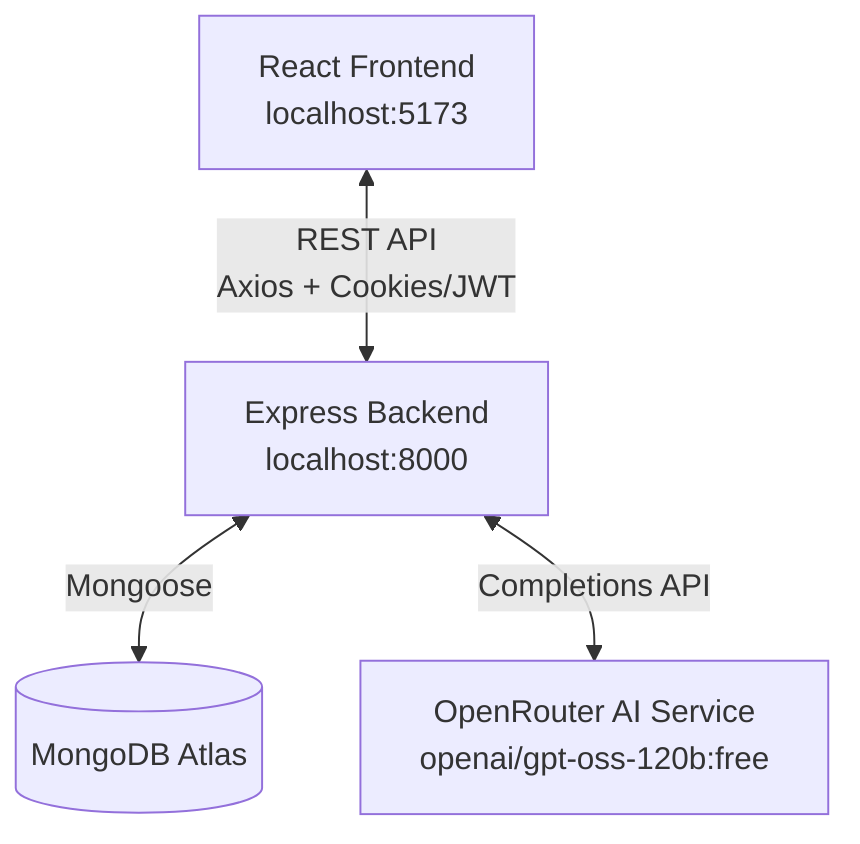
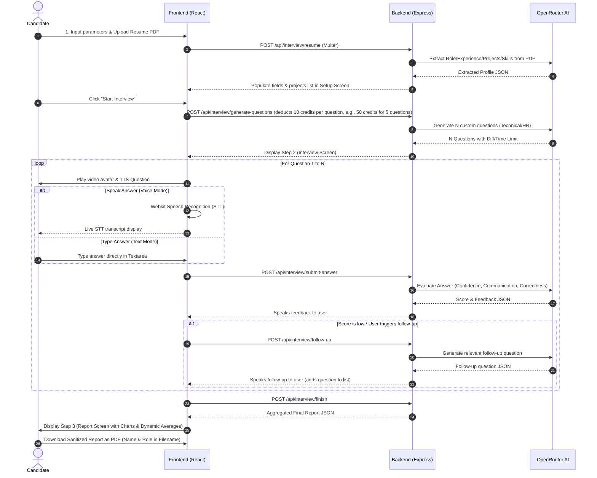

# IntervuAI — Full-Stack AI-Powered Interview Prep Platform

An advanced, full-stack AI-powered mock interview platform designed to help users prepare for technical and HR interviews. The platform provides an interactive experience where an AI interviewer speaks questions, listens to voice answers, evaluates responses across multiple dimensions, and generates detailed, downloadable performance reports.

---

## 🚀 Key Features

- 🎙️ **Interactive AI Interviewer**: Live voice interaction using Web Speech API (TTS) and Webkit Speech Recognition (STT).
- 📄 **Resume Parsing**: Upload PDF resumes to extract role, experience level, key projects, and skills via AI.
- ⚙️ **Custom Interview Setup**: Choose between **Technical** and **HR** modes with a structured difficulty progression (Easy → Medium → Hard) and custom question-selection algorithms.
- 🤖 **Context-Aware Questioning**: AI dynamically tailors questions based on the candidate's resume, specific projects, and selected focus area.
- 📊 **Detailed Evaluation & Scoring**: Each answer is evaluated by a 120-billion parameter LLM across three core pillars:
  - *Confidence & Clarity*
  - *Communication*
  - *Correctness & Completeness*
- 📈 **Performance Analytics**: Visualized performance graphs (scores per question, skill breakdown charts) showing the average scores of all answers in that session, along with persistent report links.
- 💳 **Credit-Based System**: Integrated credit validation (e.g., 50 credits per interview session) to manage API resources.
- 🖨️ **Sanitized PDF Report Export**: Professional PDF report generation using `jsPDF` that automatically sanitizes smart quotes and em-dashes to avoid font encoding errors. The resulting PDF filename is custom-tailored using the candidate's name and target role (e.g., `IntervuAI_Report_CandidateName_Role.pdf`).
- 📁 **Modular UI Structure**: Uses custom Tailwind-based component architecture structured under `/components/ui/` with path aliasing (`@/`).

---

## 🛠️ Tech Stack

### Frontend (`client/`)
* **Framework**: React 19, Vite 6, React Router DOM v7
* **State Management**: Redux Toolkit, React Redux
* **Styling & Animation**: Tailwind CSS v4, Motion (Framer Motion)
* **Authentication**: Firebase Client SDK (Google OAuth)
* **HTTP Client**: Axios (configured with cookies/credentials)
* **Visualization**: Recharts, react-circular-progressbar
* **PDF Export**: jsPDF + jspdf-autotable
* **Icons**: React Icons
* **UI Primitives**: Radix UI Slot, Class Variance Authority (CVA), Clsx, Tailwind Merge

### Backend (`server/`)
* **Runtime**: Node.js (ESM modules)
* **Framework**: Express 5
* **Database**: MongoDB (via Mongoose 9)
* **Authentication & Credentials**: JSON Web Token (JWT) with HTTP-only cookies
* **AI Service**: OpenRouter API (`openai/gpt-oss-120b:free` model)
* **PDF Parser**: `pdfjs-dist` (legacy build for extracting text from resume uploads)
* **File Upload**: Multer

---

## 🏗️ Architecture



### Monorepo Structure
```
ai_mock_interview/
├── client/                 # React frontend application
│   ├── src/
│   │   ├── assets/         # Audio, video, and image assets
│   │   ├── components/     # UI Components (Step1SetUp, Step2Interview, Step3Report, ErrorBoundary, ProtectedRoute, Navbar, Footer)
│   │   │   └── ui/         # Base UI components (button, 404-page-not-found)
│   │   ├── lib/            # Shared libraries and helper utilities (utils.js defining cn helper)
│   │   ├── pages/          # Page views (Home, Auth, InterviewPage, InterviewHistory, Pricing, InterviewReport, NotFound)
│   │   ├── redux/          # Redux Toolkit store (store.js, userSlice.js)
│   │   └── utils/          # Helper utilities (firebase.js, draftStorage.js)
│   └── package.json
└── server/                 # Express backend application
    ├── config/             # DB setup (connectDB.js, token.js)
    ├── controllers/        # Route logic (auth, user, interview)
    ├── middlewares/        # Express middlewares (auth, multer)
    ├── models/             # Mongoose schemas (User, Interview)
    ├── routes/             # Router mappings (auth, user, interview)
    ├── services/           # Service layer wrappers (openRouter.service.js)
    ├── index.js            # App entry point with express-ws initialization
    └── package.json
```

---

## ⚙️ Environment Setup

### 1. Set Up the Backend
Navigate to the `server/` directory and create a `.env` file:
```bash
cd server
```

Create a `.env` file containing the following variables:
```env
PORT=8000
MONGODB_URL=your_mongodb_connection_string
JWT_SECRET=your_jwt_secret_key
OPENROUTER_API_KEY=your_openrouter_api_key
```

### 2. Set Up the Frontend
Navigate to the `client/` directory and create a `.env` file:
```bash
cd ../client
```

Create a `.env` file containing the following variables:
```env
VITE_FIREBASE_API_KEY=your_firebase_api_key
VITE_SERVER_URL=http://localhost:8000 # Optional, defaults to http://localhost:8000
```

> **Note**: Ensure that Google Authentication is enabled under the Authentication settings in your Firebase project console.

---

## 🚀 Running the Application

### Start Backend Server
```bash
cd server
npm install
npm run dev
```
Runs the Express server with WebSocket support on [http://localhost:8000](http://localhost:8000).

### Start Frontend Client
```bash
cd client
npm install
npm run dev
```
Runs the Vite development server on [http://localhost:5173](http://localhost:5173).

---

## 📋 Interview Flow



### Credit System Logic
- New users start with **300 credits** by default.
- Launching an interview costs **10 credits per question** generated (e.g., a standard 5-question interview costs **50 credits**).
- Credits are deducted at the question generation stage (`generate-questions`), and the user must possess at least the required credit cost to begin the session.

---

## 🛠️ API Documentation

Interactive Swagger (OpenAPI 3.0) documentation is served directly from the server. You can view, test, and interact with the API endpoints by navigating to:
* **Local Development**: `http://localhost:8000/api-docs`
Below is a summary of the available API namespaces:

### Authentication (`/api/auth`)
* `POST /api/auth/google` - Verifies Firebase ID Token, logs in/creates the user, and signs/issues JWT in an HTTP-only cookie.
* `GET /api/auth/logout` - Clears the session cookie.

### User Configuration (`/api/user`)
* `GET /api/user/current-user` - Returns the authenticated user's profile and credits.

### Interview Management (`/api/interview`)
* `POST /api/interview/resume` - Accepts a resume PDF via Multer, extracts textual data using `pdfjs-dist`, and calls AI to get role/experience/projects/skills JSON.
* `POST /api/interview/generate-questions` - Generate 5 questions, deduct 50 credits, create Interview doc.
* `POST /api/interview/submit-answer` - AI evaluates answer → confidence/communication/correctness/score/feedback.
* `POST /api/interview/follow-up` - Dynamically generates follow-up context in response to weak answers.
* `POST /api/interview/finish` - Avg all question scores, mark interview Completed, return aggregated scores.
* `GET /api/interview/get-interviews` - List all interviews (summary fields only), sorted newest first.
* `GET /api/interview/progress` - Loads historical data showing progress over time.
* `GET /api/interview/resume/:id` - Restores and resumes an incomplete interview.
* `GET /api/interview/report/:id` - Full interview report with per-question scores + feedback.

### Routing Fallbacks
* **Frontend Wildcard Routing**: Any unmatched client path (`*`) is routed to the new custom `NotFound` page using React Router.
* **Backend API Fallback**: Any unmatched API endpoint returns a standard JSON error response (`{ message: "API endpoint not found" }` with a 404 status code).

---

## 📄 License
This project is open-source and licensed under the MIT License.
